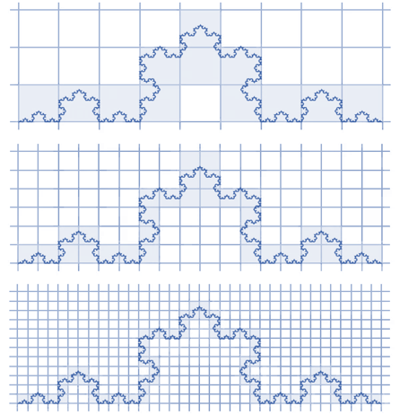

# Estimation_of_fractal_dimensionality

В рамках проделанной работы был проведен анализ материала о фрактальной размерности, а также разработан компьютерный метод определения box-counting размерности для фракталов. Данный алгоритм показал результат, расхождение которого с теоретическим значением размерности не превышает 10%, что свидетельствует о хорошей точности подхода.

  

С помощью данного алгоритма был проверен парадокс береговой линии. В результате может быть получено множество различных «береговых линий», в зависимости от используемых данных и методов.
Полученные результаты могут быть применены в широком спектре задач — от оценки длины контура объекта до изучения свойств материалов и биологических систем. Например, фрактальный анализ применяется для исследования кровеносных сосудов, бронхиальных деревьев и отдельных нейронов. В современной медицине начали использовать данные фрактального анализа состава крови, состояния костных тканей, ЭКГ и компьютерной томографии, также планируют применять его для выявления патологий органов.

Работа демонстрирует значимость и применимость понятия фрактальной размерности для описания сложности структуры объектов. Она показывает, что фрактальная размерность не только теоретически обоснована, но может быть вычислена алгоритмически на основе изображений объектов. Это дает возможность к практическому применению математической модели дробной размерности для анализа различных систем, позволяя более точно описывать их свойства и поведение.
